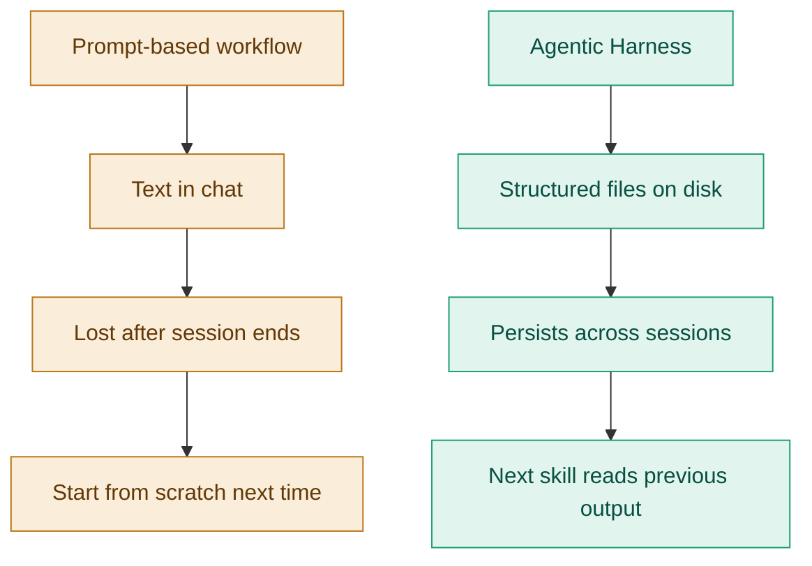

# Agentic PM Harness

A full PM discovery pipeline — from company context to clickable prototype — built as a chain of Claude Code skills where each step produces structured artifacts that feed the next.

---

## The Problem

Discovery work follows the same structure on every product bet — company context, market research, user research, PRD, prototype. Most PMs rebuild it from scratch each time, across disconnected tools, losing context at every handoff. By the time a prototype exists, the research that shaped it is buried in a different document or a different conversation.

This harness changes the architecture: each skill produces a structured artifact on disk, and the next skill reads it automatically. The research informs the PRD. The PRD drives the prototype. State doesn't get lost — it accumulates.

---

## How It Works

```mermaid
flowchart LR
    A([Company Context]) -->|4 context files| B([Market Research])
    B -->|market-research.md| C([User Research])
    C -->|user-research.md| D([PRD])
    D -->|prd.md · P0/P1/P2| E([Prototype])
    E -->|clickable HTML| F([Done])

    style A fill:#e8e4f8,stroke:#7F77DD,color:#3C3489
    style B fill:#e1f5ee,stroke:#1D9E75,color:#085041
    style C fill:#e1f5ee,stroke:#1D9E75,color:#085041
    style D fill:#e1f5ee,stroke:#1D9E75,color:#085041
    style E fill:#e8e4f8,stroke:#7F77DD,color:#3C3489
    style F fill:#f1efe8,stroke:#888780,color:#444441
```



Each skill runs independently or as part of the chain. The Prototype skill reads the PRD and company context automatically — no manual input required at that stage.

---

## The Design Decision

Most AI-assisted workflows produce text in a chat window. Text in a chat window has no memory — each session starts from scratch.

This harness is built differently. Every skill writes its output to disk as a structured markdown file. Files are the memory. The next skill reads the file, not the conversation history. This means:

- The chain survives session boundaries
- Any skill can be re-run independently without rebuilding context
- Output files are permanent artifacts — shareable, version-controllable, reusable across products



---

## What's In This Repo

```
agentic-pm-harness/
├── README.md
├── skills/
│   ├── company-context-builder.md   ← scrapes website, generates 4 context files
│   ├── market-research.md           ← structured market sizing and competitive dynamics
│   ├── user-research.md             ← JTBD, findings, pain points, product implications
│   ├── prd.md                       ← full PRD with P0/P1/P2 requirements
│   └── mock.md                      ← clickable HTML prototype from P0 requirements
└── examples/
    └── charter-spectrum/
        ├── company-overview.md      ← Spectrum Aura platform context
        ├── user-persona.md          ← composite persona, goals, pain points
        ├── product-description.md   ← Know/Act/Trust architecture, use cases
        └── competitive-landscape.md ← Comcast, AT&T, T-Mobile, ASAPP comparison
```

The `examples/charter-spectrum/` folder shows full pipeline output for Spectrum Aura — Charter's agentic AI platform serving 32M+ customers across 250M annual contacts.

---

## Built by
Prasad MK · [linkedin.com/in/prasadmk](https://linkedin.com/in/prasadmk) · prasad.mks@gmail.com
